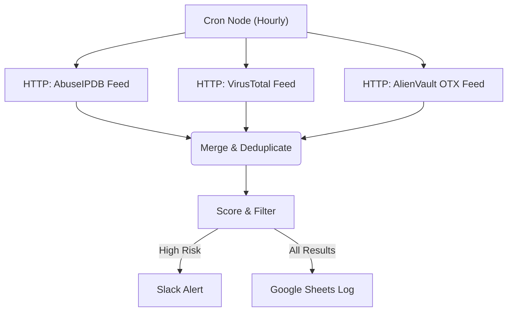

# Threat Intel Aggregator & Alerting

This project provides an **n8n workflow** that aggregates threat intelligence from multiple sources and sends real‑time alerts for high‑risk threats. The workflow runs on an hourly schedule and pulls feeds from **AbuseIPDB**, **VirusTotal**, and **AlienVault OTX**. Results are deduplicated, scored based on severity and confidence, and high‑risk findings are sent to Slack while all results are logged in Google Sheets.

## Features

- Scheduled hourly trigger using the Cron node
- HTTP requests to AbuseIPDB, VirusTotal, and AlienVault OTX threat feeds
- Merge and deduplicate results across sources
- Simple scoring system to classify threats by severity
- Slack alerts for high‑risk threats with threat details
- Google Sheets (or PostgreSQL) logging for all aggregated results
- Modular design with environment variables for API keys and credentials

## Workflow Diagram

## Getting Started

1. Set up environment variables defined in `.env.sample` with your own API keys and credentials.
2. Follow the steps in `agent_playbook.md` to build the n8n workflow.
3. Import the generated JSON into your n8n instance and configure the Slack and Google Sheets credentials.
4. Test the workflow by running it manually to verify alerts and data logging.

## Files

- **agent_playbook.md** – step‑by‑step instructions for recreating the workflow in n8n.
- **.env.sample** – template for required API keys and credentials.
- **diagram.md** – Mermaid diagram showing the flow of data through the workflow.
- **samples.json** – example aggregated threat data for testing.
- **LICENSE** – the MIT License for this project.
