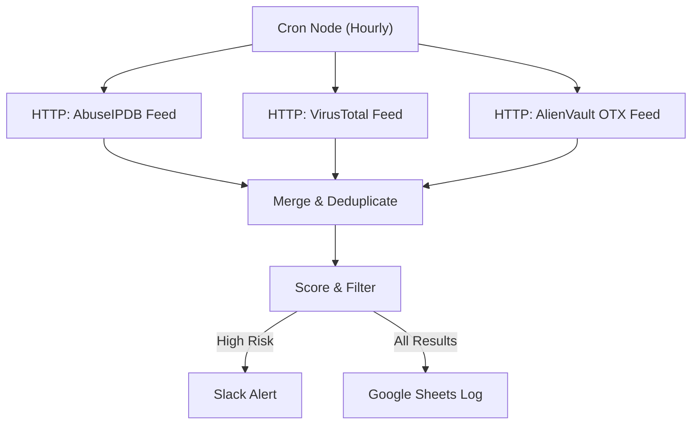

```

```mermaid
graph TD
  Cron["Cron Node (Hourly)"] --> AbuseIPDB["HTTP: AbuseIPDB Feed"]
  Cron --> VirusTotal["HTTP: VirusTotal Feed"]
  Cron --> OTX["HTTP: AlienVault OTX Feed"]
  AbuseIPDB --> Merge
  VirusTotal --> Merge
  OTX --> Merge
  Merge["Merge & Deduplicate"] --> Score["Score & Filter"]
  Score -->|"High Risk"| Slack["Slack Alert"]
  Score -->|"All Results"| Sheets["Google Sheets Log"]
```
```
